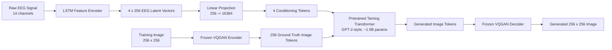
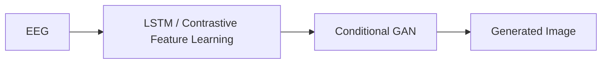
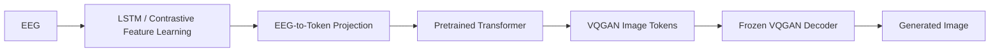

# Transforming Thoughts into Images with Transformers

EEG-conditioned image generation using an LSTM feature encoder, a partially fine-tuned pretrained Taming Transformer, and a frozen ImageNet-pretrained VQGAN.

This project investigates whether the conditional GAN stage used in EEG2Image can be replaced with a Transformer-based generative architecture. The system converts EEG recordings into semantic latent representations, projects those representations into discrete conditioning tokens, autoregressively generates image tokens with a large pretrained Transformer, and reconstructs 256×256 RGB images using a frozen VQGAN decoder.

The best configuration achieved an **Inception Score of 6.94**, compared with **6.78** for the original GAN-based EEG2Image baseline.

---

## Overview

The original EEG2Image pipeline learns semantic representations from EEG signals using an LSTM with contrastive learning and then generates images using a conditional GAN.

This project keeps the EEG representation-learning stage and replaces the GAN generator with a Transformer operating in VQGAN's discrete latent space.



The architecture combines three main components:

1. **LSTM-based EEG feature extraction**
2. **VQGAN-based image tokenization and reconstruction**
3. **A pretrained autoregressive Transformer for EEG-conditioned image-token generation**

---

## Key Contributions

- Replaced the GAN image-generation stage in EEG2Image with a pretrained autoregressive Transformer.
- Converted EEG representations into discrete conditioning tokens compatible with the VQGAN codebook.
- Used a large pretrained Taming Transformer rather than training a generative model from scratch.
- Froze the pretrained VQGAN during EEG-conditioned training.
- Evaluated selective fine-tuning of the final **3, 5, 8, and 12 Transformer layers**.
- Compared multiple batch sizes and fine-tuning depths.
- Achieved a best **Inception Score of 6.94**, outperforming the EEG2Image GAN baseline score of 6.78.

---

# Architecture

## 1. EEG Feature Extraction

The EEG representation-learning stage follows the EEG2Image approach.

### Input Data

The project uses the ThoughtViz EEG dataset.

Dataset properties:

- **23 participants**
- **Emotiv EPOC+ headset**
- **14 EEG channels**
- **128 Hz sampling rate**
- **10-second recordings**
- **1,280 samples per channel per recording**
- Three semantic categories:
  - Digits
  - Characters
  - Objects

This project focuses on the **Objects subset**, which contains ten ImageNet-derived object categories.

Each object class contains approximately **230 EEG recordings**, corresponding to 23 participants imagining or viewing each class.

### EEG Preprocessing

The preprocessed EEG data released with EEG2Image is used directly.

The preprocessing pipeline:

- applies a sliding window of **32 samples**
- uses an overlap of **8 samples**
- normalizes the resulting EEG segments
- preserves the original train/test split and data organization

The resulting EEG input to the feature extractor has shape:

```text
[batch_size, 14, 128]
```

where:

```text
14  = EEG channels
128 = timesteps
```

---

## 2. LSTM Encoder

EEG signals are processed using a two-layer unidirectional LSTM.

### Configuration

```text
LSTM layers:       2
Hidden units:      128 per layer
Input channels:    14
Timesteps:         128
Trainable params:  ~1.2M
```

The final hidden representation is converted into four 256-dimensional latent vectors:

```text
[batch_size, 14, 128]
          |
          v
     LSTM Encoder
          |
          v
      128-D state
          |
          v
  Linear Projection
          |
          v
[batch_size, 4, 256]
```

Each EEG sample therefore produces:

```text
4 x 256-dimensional latent vectors
```

### Contrastive Representation Learning

The EEG feature extractor is trained using semi-hard triplet loss:

```math
L_{triplet}
=
\max
\left(
\|f(x_a)-f(x_p)\|_2^2
-
\|f(x_a)-f(x_n)\|_2^2
+
\beta,
0
\right)
```

where:

- `x_a` = anchor EEG sample
- `x_p` = positive sample
- `x_n` = negative sample
- `β = 0.5`

### LSTM Training

The LSTM training continues from the pretrained EEG2Image checkpoint.

```text
Pretrained checkpoint:  ~2420 epochs
Final training:         ~3000 epochs
Optimizer:              AdamW
Learning rate:          1e-4
Weight decay:           0.01
Batch size:             32
```

The learned EEG representation achieves approximately:

```text
Test k-means accuracy: 53%
```

After preprocessing and segmentation, the Transformer experiments use:

```text
Training EEG latent vectors: 45,440
Testing EEG latent vectors:   5,706
```

---

# EEG-to-Token Conditioning

The Transformer operates on discrete image-token IDs, while the LSTM produces continuous 256-dimensional EEG vectors.

To bridge the two representations, each EEG latent vector is projected into logits over the VQGAN codebook:

```python
nn.Linear(256, 16384)
```

For one EEG sample:

```text
4 x 256 EEG vectors
        |
        v
4 x 16,384 codebook logits
        |
        v
Argmax / discrete selection
        |
        v
4 conditioning token IDs
```

The conditioning representation is therefore:

```text
c_indices ∈ N^4
```

This learned projection ensures that EEG representations are mapped into valid VQGAN token IDs in the range:

```text
0 ... 16,383
```

and avoids heuristic scaling of EEG features.

---

# VQGAN Image Tokenization

The model uses a pretrained VQGAN to represent images as discrete latent tokens.

## VQGAN Configuration

```text
Input image resolution: 256 x 256
Latent resolution:      16 x 16
Latent channels:        256
Codebook size:          16,384
Embedding dimension:    256
Encoder + decoder:      ~63.5M parameters
```

The encoder compresses:

```text
256 x 256 x 3 image
        |
        v
16 x 16 x 256 latent representation
        |
        v
Nearest-neighbour vector quantization
        |
        v
16 x 16 discrete token grid
```

Each image therefore corresponds to:

```text
256 discrete image tokens
```

## VQGAN Codebook

The codebook contains:

```text
K = 16,384 embeddings
Embedding dimension = 256
```

For encoder output `z_e`, vector quantization selects the nearest codebook embedding:

```math
z_q = \arg\min_k \|z_e - e_k\|_2
```

## VQGAN Pretraining

The VQGAN is pretrained on ImageNet using a composite objective containing:

```text
L1 reconstruction loss
LPIPS perceptual loss
Codebook loss
GAN loss
```

Conceptually:

```math
L_{VQGAN}
=
\|x-\hat{x}\|_1
+
\lambda \cdot LPIPS(x,\hat{x})
+
L_{codebook}
+
L_{GAN}
```

with:

```text
λ = 0.1
```

During EEG-conditioned training, the VQGAN remains **frozen**.

It is used only as:

1. an image tokenizer during training
2. an image decoder during inference

---

# Transformer Image Generator

The generative model is based on the **Taming Transformers Net2Net architecture**.

It uses a large GPT-2-style autoregressive Transformer.

## Transformer Configuration

| Property | Value |
|---|---:|
| Transformer layers | **48** |
| Attention heads | **24 per layer** |
| Head dimension | **64** |
| Embedding dimension | **1,536** |
| Context length | **256 tokens** |
| Total parameters | **~1.5B** |

The Transformer is pretrained for image-token generation and is **not trained from scratch** on the EEG dataset.

This is important because the EEG dataset contains only tens of thousands of latent training examples, while training a 1.5B-parameter generative Transformer from scratch would normally require far more data.

---

# Transformer Conditioning

The four EEG-derived conditioning tokens are prepended to the image-token sequence.

Conceptually:

```text
[c1, c2, c3, c4, z1, z2, ..., zt]
```

where:

- `c1 ... c4` are EEG conditioning tokens
- `z1 ... zt` are VQGAN image tokens

At each step, the Transformer models:

```math
p(z_t \mid c_1,c_2,c_3,c_4,z_1,\ldots,z_{t-1})
```

The model therefore learns to predict the next image token given:

1. the semantic EEG conditioning
2. previously generated image tokens

Because the maximum context length is 256, conditioning is limited to four EEG tokens and sequence length is dynamically managed to avoid context overflow.

---

# Training Objective

The Transformer is optimized with autoregressive cross-entropy loss:

```math
L_{transformer}
=
-\sum_t \log p(z_t \mid c,z_{<t})
```

where:

- `c` represents EEG conditioning tokens
- `z_t` is the target VQGAN token
- `z_<t` represents previously observed/generated image tokens

The model is therefore trained in **discrete latent space**, not directly in RGB pixel space.

---

# Partial Fine-Tuning Strategy

The full Transformer contains approximately **1.5 billion parameters**.

Fine-tuning the full model would be computationally expensive and would increase the risk of overfitting on the relatively small EEG dataset.

Instead, most Transformer layers remain frozen and only the later layers are selectively unfrozen.

Four configurations were evaluated.

| Experiment | Batch Size | Unfrozen Layers | Trainable Parameters | % of Transformer |
|---|---:|---:|---:|---:|
| **B64_L3** | 64 | Last 3 | 110M | 7.3% |
| **B64_L8** | 64 | Last 8 | 251M | 16.7% |
| **B32_L5** | 32 | Last 5 | 166M | 11.1% |
| **B32_L12** | 32 | Last 12 | 365M | 24.3% |

Even the largest experiment fine-tunes less than one quarter of the full Transformer.

The purpose of selective fine-tuning is to preserve the pretrained model's learned image-generation prior while allowing later layers to adapt to EEG-derived semantic conditioning.

---

# Training Configuration

The Transformer experiments were trained for **20 epochs**.

```text
Optimizer:          AdamW
Learning rate:      1e-4
Betas:              (0.9, 0.95)
Gradient clipping:  1.0
Loss:               Cross-entropy
LR schedule:        Cosine decay
Warmup:             500 steps
```

Selective weight decay follows the Taming Transformers / minGPT-style parameter grouping:

```text
Weight decay 0.01:
  selected weight parameters

Weight decay 0.0:
  biases
  normalization parameters
  embedding parameters
```

## Hardware

Experiments were conducted on:

```text
NVIDIA A40
48 GB VRAM
```

The size of the Transformer and the limited EEG dataset motivated the partial fine-tuning strategy.

---

# Inference

At inference time, only EEG data is provided.

```mermaid
flowchart LR
    A[EEG Signal] --> B[LSTM Encoder]
    B --> C[4 x 256 EEG Latents]
    C --> D[Codebook Projection]
    D --> E[4 Conditioning Tokens]
    E --> F[Autoregressive Transformer]
    F --> G[Generated VQGAN Tokens]
    G --> H[Frozen VQGAN Decoder]
    H --> I[256 x 256 Generated Image]
```



Generation uses autoregressive token sampling.

```text
Top-k:        100
Temperature:  0.9
```

At each step:

1. the Transformer receives EEG conditioning tokens and previously generated image tokens
2. logits for the next VQGAN token are produced
3. top-k filtering is applied
4. temperature scaling is applied
5. the next token is sampled
6. the process repeats until the image-token sequence is complete

The generated token sequence is then decoded by the frozen VQGAN decoder.

---

# Dataset

The project uses the **ThoughtViz** EEG dataset through the preprocessing and splits released with EEG2Image.

## Objects Subset

Only the Objects subset is used for the Transformer experiments.

```text
Participants:       23
EEG channels:       14
Sampling rate:      128 Hz
Recording length:   10 seconds
Object classes:     10
Samples per class:  ~230
```

The object classes are derived from ImageNet.

## Task Definition

The dataset does not provide a unique EEG-to-image mapping for every trial.

The task is therefore best interpreted as:

```text
EEG-conditioned semantic image generation
```

rather than pixel-perfect reconstruction of the exact visual stimulus.

For example:

```text
EEG associated with "watch"
        |
        v
generate a semantically valid watch image
```

The goal is for generated images to:

- align with the intended semantic class
- preserve recognizable object characteristics
- maintain diversity within each class

---

# Experiments

The experimental study investigates two factors:

1. **batch size**
2. **number of trainable Transformer layers**

Four configurations were evaluated:

```text
B64_L3
Batch size: 64
Last 3 Transformer layers unfrozen
```

```text
B64_L8
Batch size: 64
Last 8 Transformer layers unfrozen
```

```text
B32_L5
Batch size: 32
Last 5 Transformer layers unfrozen
```

```text
B32_L12
Batch size: 32
Last 12 Transformer layers unfrozen
```

---

# Results

## Final Training Loss

| Experiment | Batch Size | Unfrozen Layers | Final Loss |
|---|---:|---:|---:|
| B32_L5 | 32 | 5 | **0.098** |
| B32_L12 | 32 | 12 | 0.11 |
| B64_L3 | 64 | 3 | 0.21 |
| B64_L8 | 64 | 8 | 0.19 |

The smaller batch-size configurations converged more effectively.

The strongest result was obtained with:

```text
Batch size:       32
Unfrozen layers:  5
Final loss:       0.098
```

---

## Inception Score

Generated images were evaluated using **Inception Score (IS)**.

Conceptually:

```math
IS =
\exp
\left(
E_x[
KL(p(y|x)\|p(y))
]
\right)
```

A higher Inception Score indicates that generated images are:

- confidently classifiable
- diverse across generated samples

### Comparison

| Model | Inception Score |
|---|---:|
| EEG2Image GAN baseline | **6.78** |
| Transformer B64_L3 | 6.15 |
| Transformer B64_L8 | 6.34 |
| Transformer B32_L12 | 6.89 |
| **Transformer B32_L5** | **6.94** |

The best Transformer configuration improves the Inception Score from:

```text
6.78 -> 6.94
```

corresponding to an improvement of approximately:

```text
2.4%
```

over the original GAN-based baseline.

---

# Training Dynamics

All configurations begin with relatively high training losses of approximately:

```text
4.8 - 5.4
```

The largest improvement occurs during the first few epochs.

By approximately epochs 7 to 8:

```text
most configurations reach loss < 1.0
```

Training curves begin to flatten around epoch 10, indicating diminishing improvements during the final part of training.

The experiments show a clear interaction between batch size and model flexibility.

### Smaller batch sizes

Batch size 32 consistently performs better than batch size 64.

More frequent gradient updates appear to help the model learn subtle EEG-conditioned patterns.

### Number of unfrozen layers

Too few trainable layers limit adaptation to the EEG domain.

However, unfreezing substantially more layers does not necessarily improve performance and may increase overfitting or training instability.

The **five-layer configuration provides the strongest balance between adaptation and generalization**.

---

# Qualitative Results

The model generates recognizable object-level images conditioned on EEG signals.

Examples in the experiments include classes such as:

- **gold**
- **watch**

Generated samples show:

- clear object boundaries
- recognizable semantic structure
- preservation of class-specific visual characteristics
- multiple variations within the same class
- improved visual coherence compared with the GAN baseline

For example, generated watch samples preserve features such as:

- circular watch faces
- band structures
- metallic appearance
- visible hour markers

Generated gold samples preserve:

- golden color
- reflective appearance
- decorative structure

The generated images are not fully photorealistic, but they preserve meaningful semantic and visual characteristics associated with their EEG-conditioned classes.

---

# Comparison with EEG2Image

The original EEG2Image approach can be summarized as:



This project replaces the generative stage with:



The main difference is that the model no longer learns image generation through adversarial GAN training.

Instead, it adapts a pretrained Transformer that already models high-level image-token distributions.

---

# Technology Stack

- **Python**
- **PyTorch**
- **PyTorch Lightning**
- **TensorFlow / Keras**
- **Taming Transformers**
- **Net2NetTransformer**
- **VQGAN**
- **LSTM**
- **Triplet / contrastive representation learning**
- **OmegaConf**
- **NumPy**
- **OpenCV**
- **torchvision**
- **scikit-learn**
- **Inception-based image evaluation**

---

# Limitations

## Dataset Size

The EEG dataset is small relative to the scale of the generative model.

Even after segmentation, approximately 45,000 latent training samples remain far below the data volume normally used to train billion-parameter Transformers.

## Class-Level Generation

The dataset does not provide a unique image target for every EEG recording.

The model therefore performs semantic, class-conditioned generation rather than exact reconstruction of a specific viewed image.

## Computational Cost

The Transformer contains approximately 1.5B parameters.

Even with selective fine-tuning, training requires substantial GPU memory.

Experiments were performed on an NVIDIA A40 with 48 GB VRAM.

## Limited Hyperparameter Exploration

The computational requirements of the model limited the number of fine-tuning configurations that could be tested.

---

# Future Work

Potential extensions include:

- replacing the LSTM with an EEG-specific Transformer encoder
- self-supervised pretraining on larger unlabeled EEG datasets
- subject-independent EEG representation learning
- more advanced EEG-to-token alignment objectives
- cross-attention conditioning rather than discrete prefix tokens
- parameter-efficient fine-tuning using LoRA or adapters
- larger EEG datasets with explicit EEG-to-image pairings
- CLIP-based semantic evaluation
- diffusion-based image decoders
- subject-level generalization experiments
- improved neural-signal-specific attention mechanisms

---

# References

## EEG2Image

P. Singh et al.  
**EEG2IMAGE: Image Reconstruction from EEG Brain Signals**  
2023.

https://arxiv.org/abs/2302.10121

## Taming Transformers

P. Esser, R. Rombach, and B. Ommer.  
**Taming Transformers for High-Resolution Image Synthesis**  
CVPR 2021.

https://arxiv.org/abs/2012.09841

https://github.com/CompVis/taming-transformers

## ThoughtViz

P. Singh et al.  
**ThoughtViz: EEG-based Image Reconstruction Dataset**

https://github.com/ptirupat/ThoughtViz

## Generative Adversarial Networks

I. Goodfellow et al.  
**Generative Adversarial Networks**

https://arxiv.org/abs/1406.2661

---

# License

This repository is released under the MIT License.

External datasets, pretrained checkpoints, and third-party research components may have separate licenses and usage terms. Please refer to the original ThoughtViz, EEG2Image, and Taming Transformers repositories before redistributing external assets.
