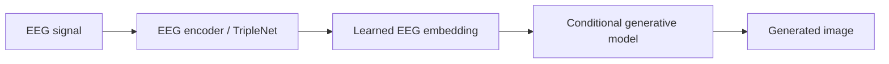

# EEG-to-Image Generation

A research implementation for generating class-conditioned images from EEG representations using deep generative models. The project combines learned EEG embeddings with GAN/VQGAN-based image generation and includes training, inference and evaluation utilities.

The repository originated as an experimental research codebase, so the current focus is on preserving the modelling work while improving reproducibility, documentation and evaluation.

## What it does



The implementation uses EEG-derived feature vectors as conditioning information for image generation. The repository contains multiple experimental components, including LSTM/TripleNet-based EEG representation learning and GAN/VQGAN-related image-generation code.

## Current components

- **EEG representation learning** with `TripleNet` / LSTM-based components
- **Conditional image generation** using GAN-based models
- **VQGAN utilities** and model-loading code
- **Training and inference scripts** for EEG-conditioned generation
- **DiffAugment** utilities for data-efficient GAN training
- **Benchmark/evaluation helpers** including Inception Score-related tooling
- **Checkpoint handling** for trained EEG and image-generation models

## Tech stack

- Python
- TensorFlow / Keras
- NumPy
- OpenCV
- GANs / DCGAN
- VQGAN-related components
- LSTM / learned EEG embeddings
- Weights & Biases hooks for experiment tracking

## Repository structure

```text
VQGAN/                  VQGAN-related loading/utilities
lstm_kmean/             EEG representation-learning components
experiments/            Model checkpoints and experiment outputs
anaconda/               Historical environment definitions
train.py                Main training workflow
inference.py            Image-generation inference
benchmark.py            Benchmarking utilities
eval_utils.py           Evaluation helpers
inceptionscore.py       Inception Score-related evaluation
diff_augment.py         DiffAugment implementation
model.py                Core generative-model components
losses.py               Training losses
utils.py                Data and visualisation helpers
```

## Data

The project was built around preprocessed ThoughtViz EEG data and paired image classes.

A historical dataset reference is available here:

[Preprocessed ThoughtViz EEG data](https://iitgnacin-my.sharepoint.com/:u:/g/personal/19210048_iitgn_ac_in/Ea4Sp2UH__ZbRQGZXu9o-6cByJK4E6E4GtxrcVony9_Q8g?e=bVdyIJ)

The repository does not currently package the full training dataset. Local paths in some scripts reflect the original experiment environment and will be moved into configuration as part of the cleanup roadmap.

## Training flow

At a high level, the current training code:

1. loads preprocessed EEG samples and image labels
2. restores a trained EEG representation model
3. extracts learned EEG feature vectors
4. combines EEG features with latent noise
5. trains a conditional image generator
6. periodically saves checkpoints and generated samples

The current implementation is research-oriented and assumes a local GPU/data layout.

## Running the project

The repository includes historical Conda environment files under `anaconda/`, but setup is not yet fully standardised.

Before running the training scripts, you will need to:

- install the required TensorFlow/ML dependencies
- download/prepare the EEG and image datasets
- update local data paths
- configure GPU settings for your environment
- provide or train the required checkpoints

Because the original experiments used machine-specific paths and GPU configuration, this repository is not yet a one-command reproducible package.

## Evaluation

The codebase includes utilities for generated-image evaluation and benchmarking, including Inception Score-related tooling and experiment checkpoints.

A future cleanup will surface the main quantitative results and generated examples directly in this README so the modelling outcome is visible without reading the implementation.

## Known limitations

- local filesystem paths are hard-coded in parts of the current research code
- GPU selection is environment-specific
- generated Python cache files and historical checkpoints are still present in the repository
- environment/dependency management needs consolidation
- the README does not yet include the original experiment's quantitative results or image samples
- provenance and adaptation of upstream model components should be documented more explicitly

## Roadmap

Planned repository cleanup and extension:

- move dataset, checkpoint and GPU settings into configuration/CLI arguments
- remove `__pycache__`, `.pyc` files and unnecessary generated artefacts from version control
- consolidate dependencies into a reproducible environment
- document dataset preparation end to end
- add representative generated-image examples to this README
- report quantitative evaluation metrics and experiment settings
- document model/component provenance and individual contributions clearly
- add lightweight tests for data-shape, inference and checkpoint-loading paths
- add CI for basic code-quality and import checks

## Naming note

The current GitHub repository is named `EEG2ImageTransformer`, but the checked-in implementation primarily contains LSTM/TripleNet, GAN/DCGAN and VQGAN-related components rather than a clearly implemented Transformer architecture. A future repository rename to something like **`eeg-to-image-generation`** would more accurately describe the current codebase.

## License

This repository is released under the MIT License. External datasets, model implementations and research components may have their own terms and should be credited accordingly.